---
## Author
author:
  name: Верниковская Екатерина Андреевна
  degrees: DSc
  orcid: 0000-0002-0877-7063
  email: kulyabov-ds@rudn.ru
  affiliation:
    - name: Российский университет дружбы народов
      country: Российская Федерация
      postal-code: 117198
      city: Москва
      address: ул. Миклухо-Маклая, д. 6

## Title
title: "Отчёт по лабораторной работе №1"
subtitle: "Дисциплина: Основы проектирования сетей и систем телекоммуникаций"
license: "CC BY"
---

# Цель работы

Целью данной работы является изучение полнодоступной двухсервисной модели Эрланга с одинаковыми интенсивностями обслуживания, а также реализация для заданных параметров расчёта распределения вероятностей, вероятности блокировки, среднего числа обслуживаемых и построение графиков зависимости вероятности блокировки от интенсивности поступления запросов на обслуживание и зависимости среднего числа обслуживаемых запросов от интенсивности поступления запросов на предоставление услуги

# Задание

1. Описать пошагово алгоритм расчета вероятностных характеристик модели (вероятности блокировки запроса каждого типа, среднего числа запросов в системе)

2. Составить программу, реализующую расчет распределения вероятностей, вероятности блокировки, среднего числа обслуживаемых запросов для любых значений исходных данных. Программа должна выводить на экран:

	- значение распределения вероятностей,
	- значения вероятностей блокировки,
	- значение среднего числа заявок.

3. Построить график зависимости вероятности блокировки от интенсивности поступления запросов на обслуживание

4. Построить график зависимости среднего числа обслуживаемых запросов от интенсивности поступления запросов на предоставление услуги

# Выполнение лабораторной работы

## Теория

Исследуется сота сети связи емкостью С. Пусть пользователям сети предоставляются услуги
двух типов. Запросы в виде двух пуассоновский потоков (ПП) с интенсивностями $\lambda_1$, $\lambda_2$ поступают в соту. Среднее время обслуживания запросов на предоставление услуг каждого типа $\mu_1^{-1}$, $\mu_2^{-1}$ соответственно. Исследуются основные характеристики модели для случая $\mu_1 = \mu_2 = \mu$. 

В классификации Башарина-Кендалла модель обозначается как MM|MM|C|0.

Основные обозначения указаны в (табл. \ref{table:tbale})

\begin{table}[H]
\centering
\caption{Основные обозначения}
\label{table:tbale}
\begin{tabular}{|p{5cm}|p{9cm}|}
\hline
\textbf{Переменная} & \textbf{Обозначение} \\ \hline
C & пиковая пропускная способность соты \\ \hline
$\lambda_1$, $\lambda_2$ & интенсивность поступления запросов на предоставление услуги 1, 2-го типа
[запросов/ед.вр.] \\ \hline
$\mu_1^{-1}$ & среднее время обслуживания запроса на предоставление услуги 1, 2-го типа
[запросов/ед.вр.] \\ \hline
$\rho_1$, $\rho_2$ & интенсивность предложенной нагрузки, создаваемой запросами на
предоставление услуги 1, 2-го типа \\ \hline
X(t) & число запросов, обслуживаемых в системе в момент времени t , t ≥ 0 (случайный процесс (СП), описывающий функционирование системы в момент времени t , t ≥ 0 ) \\ \hline
X & пространство состояний системы \\ \hline
n & число обслуживаемых в системе запросов \\ \hline
$B_1$, $B_2$ & множество блокировок запросов на предоставление услуги 1, 2-го типа \\ \hline
$S_1$, $S_2$ & множество приема запросов на предоставление услуги 1, 2-го типа \\ \hline
\end{tabular}
\end{table}

Пространство состояний системы: $$X = \{0,\dots,C\}, \quad |X| = C + 1$$

Множество блокировок запросов на предоставление услуги i-типа, i = 1,2: $$B_1 = B_2 = \{C\}$$

Множество приема запросов на предоставление услуги i-типа, i = 1,2: $$S_i = \bar{B}_i = X \setminus B_i = \{0,\dots,C-1\}$$

Стационарное распределение вероятностей состояний системы: $$p_n = \left( \sum_{i=0}^{C} \frac{(\rho_1 + \rho_2)^i}{i!} \right)^{-1} \cdot \frac{(\rho_1 + \rho_2)^n}{n!}, \quad n = \overline{0, C}$$

Основные вероятностные характеристики (ВХ) модели:

- Вероятность блокировки по времени $E_i$ запроса на предоставление услуги i-типа, i = 1,2: $$E_1 = E_2 = E = \sum_{n \in B_i} p_n = p_C$$

- Вероятность блокировки по вызовам $B_i$ запроса на предоставление услуги i-типа, i = 1,2: $$B_i = \frac{\lambda_i}{\lambda_1 + \lambda_2} E,$$
где $\frac{\lambda_i}{\lambda_1 + \lambda_2}$ - вероятность того, что поступит запрос на предоставление услуги i-типа

- Вероятность блокировки по нагрузке $C_i$ запроса на предоставление услуги i-типа, i = 1,2: $$C_1 = C_2 = E$$

- Среднее число $\bar{N}$ обслуживаемых в системе запросов: $$\overline{N} = \sum_{n \in X} n p_n$$

## Реализация алгоритма на Julia

Код был написан на языке Julia и выполнен в среде разраоти Jupyter.

Для визуализации использовали библиотеку Plots, которая подключается командами ```using Pkg``` и ```using Plots``` (при необходимости пакет предварительно устанавливается через ```Pkg.add("Plots")```) ([рис. @fig-001])

{#fig-001 width=70%}

Далее задали начальные параметры модели. Производится ввод ёмкости системы C, интенсивности потоков запросов $\lambda_1$, $\lambda_2$ и интенсивности обслуживания $\mu$. На основе введенных данных рассчитываются предложенные нагрузки $\rho_1$, $\rho_2$. Для численного анализа были выбраны следующие параметры: $C = 121, \mu = 0.5, \lambda_1 = 50, \lambda_2 = 40$ ([рис. @fig-002])

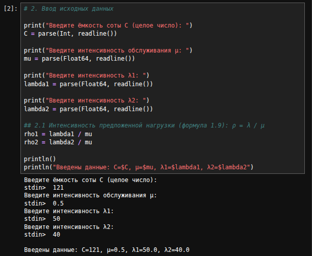{#fig-002 width=70%}

Для расчёта стационарного распределения вероятностей реализовали функцию ```stationary_probability```, которая начала находит нормирующую константу p₀ через сумму по всем состояниям, затем на её основе вычисляет вероятность каждого отдельного состояния p(n). Возвращает массив из значений вероятностей, соответствующих числу одновременно обслуживаемых в системе запросов от 0 до C ([рис. @fig-003])

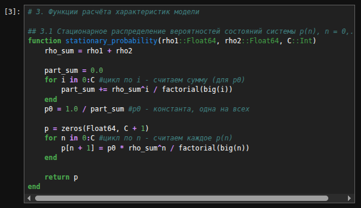{#fig-003 width=70%}

Для расчёта вероятности блокировки по времени реализовали функцию ```time_blocking_probability```. Она возвращает последний элемент массива распределения p(n), соответствующий состоянию n = C ([рис. @fig-004])

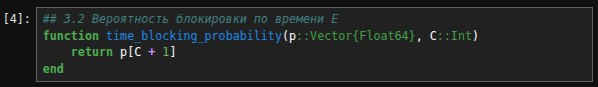{#fig-004 width=70%}

Для расчёта вероятности блокировки по вызовам реализовали функцию ```call_blocking_probability```. E домножается на долю $\frac{\lambda_i}{\lambda_1 + \lambda_2}$ - вероятность того, что поступивший запрос относится именно к типу i. Функция универсальна для обоих типов услуг ([рис. @fig-005])

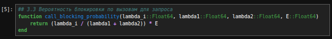{#fig-005 width=70%}

Для расчёта среднего числа обслуживаемых в системе запросов реализовали функцию ```average_requests```. Суммирует произведения n·p(n) по всем состояниям системы от n=0 до n=C. Результат — математическое ожидание числа одновременно занятых каналов при заданной нагрузке ([рис. @fig-006])

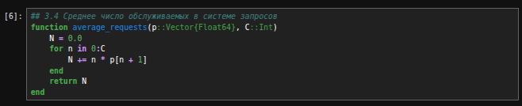{#fig-006 width=70%}

После запустили программу с заданными параметрами и получили стационарное распределение вероятностей состояний системы. На экран вывелись значения $p_n$ для всех n от 0 до C, а также сумма вероятностей, которая равна 1 ([рис. @fig-007]), ([рис. @fig-008])

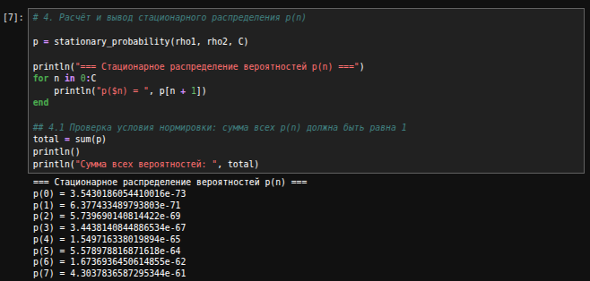{#fig-007 width=70%}

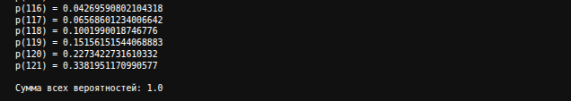{#fig-008 width=70%}

Далее вывели значения вероятностных характеристик модели. 

Вероятность блокировки по времени E = 0.3381951170990577 ([рис. @fig-009])

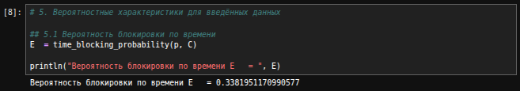{#fig-009 width=70%}

Вероятность блокировки по вызовам $B_1$ = 0.18788617616614317, $B_2$ = 0.15030894093291453 ([рис. @fig-010])

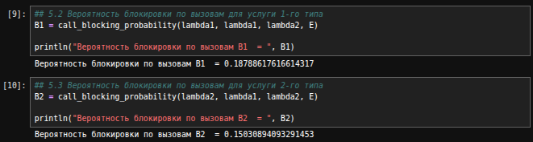{#fig-010 width=70%}

Среднее число обслуживаемых запросов в системе N = 119.12487892216961 ([рис. @fig-011])

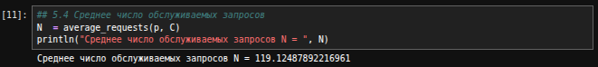{#fig-011 width=70%}

## Построение графиков

Для построения графиков зависимостей вероятностных характеристик от интенсивности поступления запросов $\lambda_1$ был организован цикл по диапазону значений $\lambda_1$ от 0.5 до C с шагом 0.5: для каждого значения $\lambda_1$ заново пересчитывались нагрузка $\rho_1$, распределение вероятностей p(n) и все характеристики модели (E, $B_1$, $B_2$, N), после чего результаты сохранялись в отдельные массивы. Это позволило получить набор точек для построения графиков зависимости вероятности блокировки по времени, вероятностей блокировки по вызовам для обоих типов услуг и среднего числа обслуживаемых запросов от интенсивности $\lambda_1$ ([рис. @fig-012])

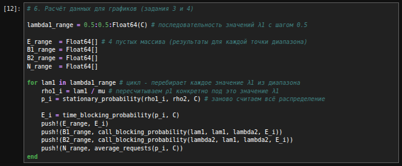{#fig-012 width=70%}

Далее на основе полученных данных построили 4 графика:

- Вероятность блокировки по времени E($\lambda_1$) ([рис. @fig-013])
- Вероятность блокировки по вызовам $B_1$($\lambda_1$) ([рис. @fig-014])
- Вероятность блокировки по вызовам $B_2$($\lambda_2$) ([рис. @fig-015])
- Среднее число запросов N(($\lambda_1$) ([рис. @fig-016])

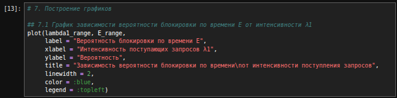{#fig-013 width=70%}

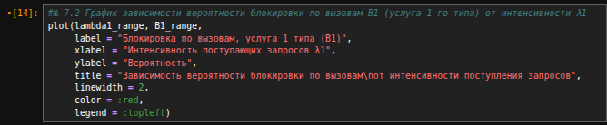{#fig-014 width=70%}

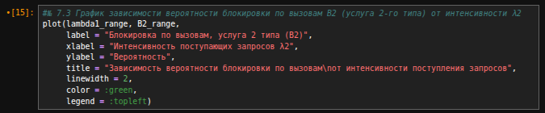{#fig-015 width=70%}

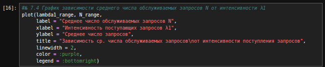{#fig-016 width=70%}

### Анализ графиков

**График E($\lambda_1$) - вероятность блокировки по времени:** на этом графике ([рис. @fig-017]) видно, что при малых значениях $\lambda_1$ (до ~10) вероятность блокировки близка к нулю - система почти всегда справляется с нагрузкой, свободных каналов достаточно. Начиная примерно с $\lambda_1$ = 15-20 кривая начинает резко расти - система приближается к насыщению, и всё чаще все C каналов оказываются заняты одновременно. При больших $\lambda_1$ (после 80-100) рост замедляется, кривая выходит на пологий участок - блокировка приближается к своему предельному значению, но не может достичь 1, так как параллельно растёт и суммарная обслуживающая способность за счёт постоянного освобождения каналов. Такая S-образная форма характерна для формулы Эрланга: система имеет запас прочности при малой нагрузке, но резко теряет производительность при приближении к ёмкости C

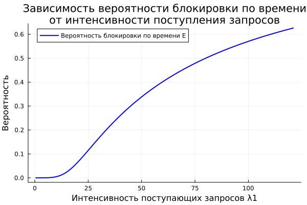{#fig-017 width=70%}

**График $B_1$($\lambda_1$) - вероятность блокировки по вызовам для услуги 1 типа:** на этом графике ([рис. @fig-018]) видно, что вероятность блокировки по вызовам для услуги 1 типа монотонно растёт с ростом $\lambda_1$, кривая близка по форме к графику E($\lambda_1$). Рост объясняется тем, что при увеличении $\lambda_1$ растёт как общая загрузка системы (и, соответственно, E), так и доля запросов первого типа в общем потоке

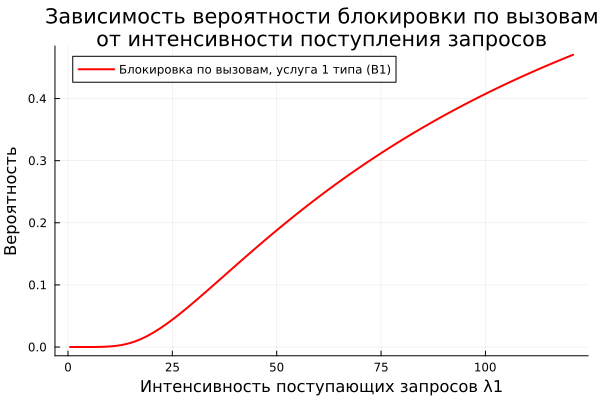{#fig-018 width=70%}

**График $B_2$($\lambda_2$) - вероятность блокировки по вызовам для услуги 2 типа:** на этом графике ([рис. @fig-019]) видно, что вероятность блокировки по вызовам для услуги 2 типа сначала растёт вместе с общей загрузкой системы, но после $\lambda_1$ ≈ 50-75 начинает снижаться. Это связано с тем, что при росте $\lambda_1$ доля запросов второго типа в общем потоке $\frac{\lambda_2}{\lambda_1 + \lambda_2}$ уменьшается быстрее, чем растёт E, поэтому их произведение после пика идёт на спад

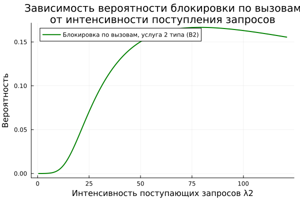{#fig-019 width=70%}

**График N($\lambda_1$) - среднее число обслуживаемых запросов:** на этом графике ([рис. @fig-020]) видно, что среднее число обслуживаемых запросов быстро растёт при малых $\lambda_1$, затем рост замедляется, и кривая приближается к горизонтальной асимптоте на уровне C = 121 - ёмкости системы. Это происходит потому, что при высокой загрузке всё больше запросов блокируется, и дальнейший рост $\lambda_1$ уже не увеличивает число обслуживаемых заявок пропорционально, а просто теряется на блокировках

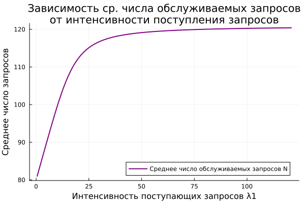{#fig-020 width=70%}

# Листинг программы


```julia
# 1. Импорт библиотек

using Pkg
Pkg.add("Plots")   # устанавливает пакет для построения графиков
using Plots        # подключаем функции plot(), plot!(), xlabel! и т.д.

# 2. Ввод исходных данных

print("Введите ёмкость соты C (целое число): ")
C = parse(Int, readline())

print("Введите интенсивность обслуживания μ: ")
mu = parse(Float64, readline())

print("Введите интенсивность λ1: ")
lambda1 = parse(Float64, readline())

print("Введите интенсивность λ2: ")
lambda2 = parse(Float64, readline())

## 2.1 Интенсивность предложенной нагрузки: ρ = λ / μ
rho1 = lambda1 / mu
rho2 = lambda2 / mu

println()
println("Введены данные: C=$C, μ=$mu, λ1=$lambda1, λ2=$lambda2")

# 3. Функции расчёта характеристик модели

## 3.1 Стационарное распределение вероятностей состояний системы p(n), n = 0,...,C
function stationary_probability(rho1::Float64, rho2::Float64, C::Int)
    rho_sum = rho1 + rho2

    part_sum = 0.0
    for i in 0:C #цикл по i - считаем сумму (для p0)
        part_sum += rho_sum^i / factorial(big(i))
    end
    
    p0 = 1.0 / part_sum #p0 - константа, одна на все
    
    p = zeros(Float64, C + 1)
    
    for n in 0:C #цикл по n - считаем каждое p(n)
        p[n + 1] = p0 * rho_sum^n / factorial(big(n))
    end

    return p
end

## 3.2 Вероятность блокировки по времени E
function time_blocking_probability(p::Vector{Float64}, C::Int)
    return p[C + 1]
end

## 3.3 Вероятность блокировки по вызовам для запроса
function call_blocking_probability(lambda_i::Float64, lambda1::Float64, lambda2::Float64, E::Float64)
    return (lambda_i / (lambda1 + lambda2)) * E
end

## 3.4 Среднее число обслуживаемых в системе запросов
function average_requests(p::Vector{Float64}, C::Int)
    N = 0.0
    for n in 0:C
        N += n * p[n + 1]
    end
    return N
end

# 4. Расчёт и вывод стационарного распределения p(n)

p = stationary_probability(rho1, rho2, C)

println("=== Стационарное распределение вероятностей p(n) ===")
for n in 0:C
    println("p($n) = ", p[n + 1])
end

## 4.1 Проверка условия нормировки: сумма всех p(n) должна быть равна 1
total = sum(p)
println()
println("Сумма всех вероятностей: ", total)

# 5. Вероятностные характеристики для введённых данных

## 5.1 Вероятность блокировки по времени
E = time_blocking_probability(p, C)
println("Вероятность блокировки по времени E   = ", E)

## 5.2 Вероятность блокировки по вызовам для услуги 1-го типа
B1 = call_blocking_probability(lambda1, lambda1, lambda2, E)
println("Вероятность блокировки по вызовам B1  = ", B1)

## 5.3 Вероятность блокировки по вызовам для услуги 2-го типа
B2 = call_blocking_probability(lambda2, lambda1, lambda2, E)
println("Вероятность блокировки по вызовам B2  = ", B2)

## 5.4 Среднее число обслуживаемых запросов
N = average_requests(p, C)
println("Среднее число обслуживаемых запросов N = ", N)

# 6. Расчёт данных для графиков (задания 3 и 4)

lambda1_range = 0.5:0.5:Float64(C) # последовательность значений λ1 с шагом 0.5

E_range  = Float64[] # 4 пустых массива (результаты для каждой точки диапазона)
B1_range = Float64[]
B2_range = Float64[]
N_range  = Float64[]

for lam1 in lambda1_range # цикл - перебирает каждое значение λ1 из диапазона 
    rho1_i = lam1 / mu # пересчитываем ρ1 конкретно под это значение λ1
    p_i = stationary_probability(rho1_i, rho2, C) # заново считаем всё распределение

    E_i = time_blocking_probability(p_i, C)
    push!(E_range, E_i)
    push!(B1_range, call_blocking_probability(lam1, lam1, lambda2, E_i))
    push!(B2_range, call_blocking_probability(lambda2, lam1, lambda2, E_i))
    push!(N_range, average_requests(p_i, C))
end

# 7. Построение графиков

## 7.1 График зависимости вероятности блокировки по времени E от интенсивности λ1
plot_E = plot(lambda1_range, E_range,
     label = "Вероятность блокировки по времени E",
     xlabel = "Интенсивность поступающих запросов λ1",
     ylabel = "Вероятность",
     title = "Зависимость вероятности блокировки по времени\nот интенсивности поступления запросов",
     linewidth = 2,
     color = :blue,
     legend = :topleft)
savefig(plot_E, "blocking_probability_E.png")
display(plot_E)                                

#№ 7.2 График зависимости вероятности блокировки по вызовам B1 (услуга 1-го типа) от интенсивности λ1
plot_B1 = plot(lambda1_range, B1_range,
     label = "Блокировка по вызовам, услуга 1 типа (B1)",
     xlabel = "Интенсивность поступающих запросов λ1",
     ylabel = "Вероятность",
     title = "Зависимость вероятности блокировки по вызовам\nот интенсивности поступления запросов",
     linewidth = 2,
     color = :red,
     legend = :topleft)
savefig(plot_B1, "blocking_probability_B1.png")
display(plot_B1)

#№ 7.3 График зависимости вероятности блокировки по вызовам B2 (услуга 2-го типа) от интенсивности λ2
plot_B2 = plot(lambda1_range, B2_range,
     label = "Блокировка по вызовам, услуга 2 типа (B2)",
     xlabel = "Интенсивность поступающих запросов λ2",
     ylabel = "Вероятность",
     title = "Зависимость вероятности блокировки по вызовам\nот интенсивности поступления запросов",
     linewidth = 2,
     color = :green,
     legend = :topleft)
savefig(plot_B2, "blocking_probability_B2.png")
display(plot_B2)

#№ 7.4 График зависимости среднего числа обслуживаемых запросов N от интенсивности λ1
plot_N = plot(lambda1_range, N_range,
     label = "Среднее число обслуживаемых запросов N",
     xlabel = "Интенсивность поступающих запросов λ1",
     ylabel = "Среднее число запросов",
     title = "Зависимость ср. числа обслуживаемых запросов\nот интенсивности поступления запросов",
     linewidth = 2,
     color = :purple,
     legend = :bottomright)
savefig(plot_N, "average_requests_N.png")
display(plot_N)
```

# Выводы

В ходе выполнения лабораторной работы №1 была изучена полнодоступная двухсервисная модель Эрланга с одинаковыми интенсивностями обслуживания, а также реализованы для заданных параметров алгоритмы расчёта распределения вероятностей, вероятности блокировки, среднего числа обслуживаемых и построены графики зависимости вероятности блокировки от интенсивности поступления запросов на обслуживание и зависимости среднего числа обслуживаемых запросов от интенсивности поступления запросов на предоставление услуги. 

Анализ графиков показал, что:

- Вероятность блокировки по времени E($\lambda_1$) монотонно возрастает
- Вероятность блокировки по вызовам $B_1$($\lambda_1$) возрастает с ростом $\lambda_1$
- Вероятность блокировки по вызовам $B_2$($\lambda_2$) сначала возрастает, а затем убывает
- Среднее число запросов N($\lambda_1$) возрастает и стремится к C

Моделирование было успешно выполнено на языке Julia.
